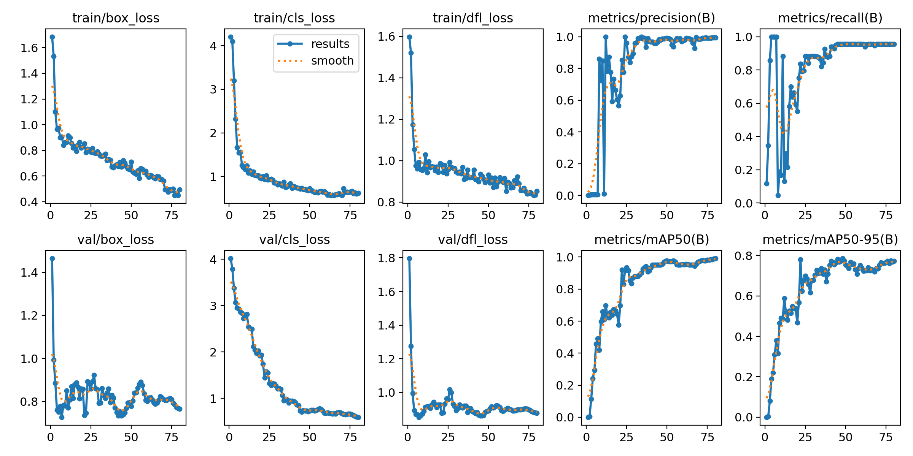

### Introduction
This document outlines the approaches considered and adopted for enhancing object detection capabilities within our project. The primary goal was to improve the accuracy and efficiency of detecting specific logos in varied conditions using machine learning models.

-------------
### Approaches Considered

#### Traditional Feature Detectors:
Techniques Used: 
- SIFT (Scale-Invariant Feature Transform)
- SURF (Speeded Up Robust Features)
- ORB (Oriented FAST and Rotated BRIEF)
- FAST

<u>Reason for Consideration:</u> These methods are well-known for feature detection and matching, which are pivotal in many image processing tasks.
 
<u>Outcome & Reason for Discontinuation:</u> The performance of these techniques was suboptimal for our specific object detection tasks. They did not provide the robustness needed for varying sizes and complexities in images.

#### Pretrained Deep Learning Models:</u>

<u>Models Tried:</u> 
- YOLO (various versions)
- ViT
- RT-DETR
 

<u>Reason for Consideration:</u> Leveraging pretrained models can significantly reduce development time and improve accuracy due to their extensive training on diverse datasets.
 
<u>Initial Outcome:</u> Direct application of these pretrained models did not yield satisfactory results, possibly due to the unique characteristics of our dataset and specific requirements.

----------------

### Chosen Approach</u>

#### Fine-tuning Deep Learning Models:</u>
Reason for Selection: Familiarity with the process and the potential for significant improvements by adapting the models to our specific context.
 
<u>Process:</u>
Dataset Creation and Annotation: Created a focused dataset consisting of 60 images for training and 10 for validation, annotated using tool V7.
The training performance was decent but it likely overfitted due to presence small subset of data.
A slightly higher number of diverse samples should improve the performance even further.
 
<u>Model Choice:</u> Initiated trials with YOLOv8n, YOLOv9, and YOLOv10n, given their recent advancements and suitability for quick iterations.
 
<u>Performance:</u> All models after fine-tuning showed significantly improved performance. The choice between models was based on a balance of performance, resource consumption, and ease of integration.

 
<u>Final Decision:</u> Selected YOLOv8n for the production pipeline due to its comparable performance with more recent versions and better integration capability within existing infrastructure.
Reasons for Discontinuation of Other Models

<u>< YOLOv8:</u> Not considered due to its older architecture and lesser performance compared to more recent versions which are better optimized for similar tasks.
 
<u>SIFT/SURF/FAST/ORB:</u> These were ruled out due to poor performance on our specific dataset, where the robustness against variations in scale and rotation is critical.

-------------

### Conclusion

The iterative approach of testing various models and fine-tuning them based on specific dataset characteristics allowed us to select an optimal solution that meets our requirements for accuracy and efficiency. 